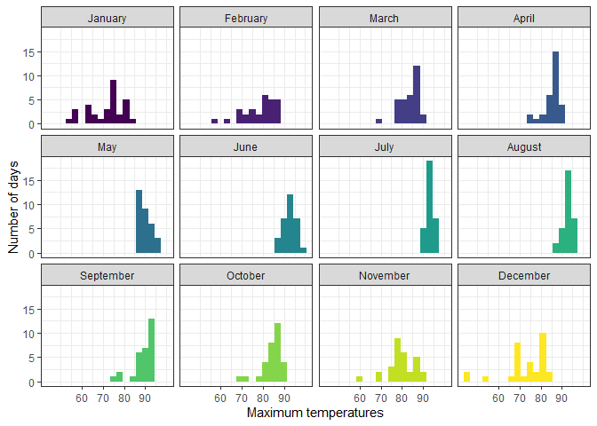
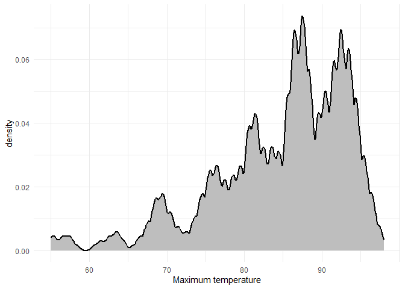
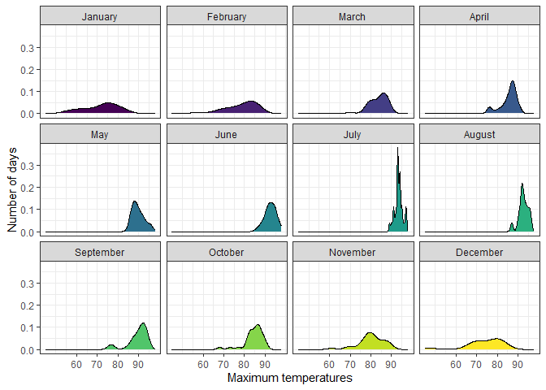
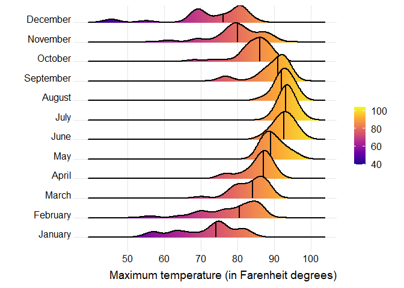
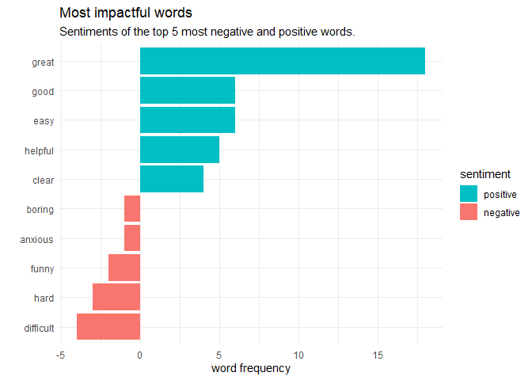
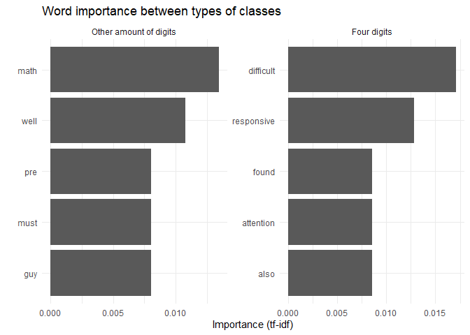

# Data Visualization Project 03


In this exercise you will explore methods to create different types of data visualizations (such as plotting text data, or exploring the distributions of continuous variables).


## PART 1: Density Plots

Using the dataset obtained from FSU's [Florida Climate Center](https://climatecenter.fsu.edu/climate-data-access-tools/downloadable-data), for a station at Tampa International Airport (TPA) for 2022, attempt to recreate the charts shown below which were generated using data from 2016. You can read the 2022 dataset using the code below: 

```r
library(tidyverse)
```

```
## Warning: package 'tidyverse' was built under R version 4.2.2
```

```
## ── Attaching packages ─────────────────────────────────────── tidyverse 1.3.2 ──
## ✔ ggplot2 3.4.0      ✔ purrr   0.3.4 
## ✔ tibble  3.1.8      ✔ dplyr   1.0.10
## ✔ tidyr   1.2.1      ✔ stringr 1.4.1 
## ✔ readr   2.1.3      ✔ forcats 0.5.2
```

```
## Warning: package 'ggplot2' was built under R version 4.2.2
```

```
## Warning: package 'readr' was built under R version 4.2.2
```

```
## ── Conflicts ────────────────────────────────────────── tidyverse_conflicts() ──
## ✖ dplyr::filter() masks stats::filter()
## ✖ dplyr::lag()    masks stats::lag()
```

```r
library(lubridate)
```

```
## Warning: package 'lubridate' was built under R version 4.2.2
```

```
## Loading required package: timechange
```

```
## Warning: package 'timechange' was built under R version 4.2.2
```

```
## 
## Attaching package: 'lubridate'
## 
## The following objects are masked from 'package:base':
## 
##     date, intersect, setdiff, union
```


```r
weather_tpa <- read_csv("https://raw.githubusercontent.com/reisanar/datasets/master/tpa_weather_2022.csv")
# random sample 
sample_n(weather_tpa, 4)
```

```
## # A tibble: 4 × 7
##    year month   day precipitation max_temp min_temp ave_temp
##   <dbl> <dbl> <dbl>         <dbl>    <dbl>    <dbl>    <dbl>
## 1  2022     6     2           1.6       91       73     82  
## 2  2022    11    24           0         79       67     73  
## 3  2022     3     8           0         86       74     80  
## 4  2022    12    12           0         76       59     67.5
```

See https://www.reisanar.com/slides/relationships-models#10 for a reminder on how to use this type of dataset with the `lubridate` package for dates and times (example included in the slides uses data from 2016).

Using the 2022 data: 

(a) Create a plot like the one below:


Hint: the option `binwidth = 3` was used with the `geom_histogram()` function.


```r
plot_1_data <- weather_tpa %>%
  mutate(
    date = ymd(paste(year, month, day)),
    monthName = month(date, label=TRUE, abbr=FALSE)
  ) %>%
  select(monthName, day, max_temp, ave_temp, precipitation, date)
```

```r
ggplot(data = plot_1_data) +
  scale_y_continuous(breaks=seq(0, 20, 5))+
  scale_x_continuous(breaks=seq(60, 90, 10)) +
  geom_histogram(mapping=aes(x=max_temp, fill=monthName), binwidth=3) + 
  labs(x = "Maximum temperatures", y = "Number of days") +
  theme_bw() +
  facet_wrap(vars(monthName)) +
  guides(fill="none")
```

<!-- -->


(b) Create a plot like the one below:


Hint: check the `kernel` parameter of the `geom_density()` function, and use `bw = 0.5`.


```r
ggplot(data = plot_1_data) + 
  geom_density(mapping=aes(x = max_temp, y=..density..), bw=0.5, kernel="epanechnikov", fill="grey", linewidth = 1, na.rm=T) +
  scale_x_continuous(limits=c(55, 98), breaks=seq(60, 90, 10)) + 
  labs(x = "Maximum temperature") + 
  theme_minimal()
```

```
## Warning: The dot-dot notation (`..density..`) was deprecated in ggplot2 3.4.0.
## ℹ Please use `after_stat(density)` instead.
```

<!-- -->


(c) Create a plot like the one below:


Hint: default options for `geom_density()` were used. 


```r
ggplot(data = plot_1_data) +
  scale_x_continuous(breaks=seq(60, 90, 10)) +
  geom_density(mapping=aes(x=max_temp, fill=monthName), na.rm=T) + 
  labs(x = "Maximum temperatures", y = "Number of days") +
  theme_bw() +
  facet_wrap(vars(monthName)) +
  guides(fill="none")
```

<!-- -->

(d) Generate a plot like the chart below:


Hint: use the`{ggridges}` package, and the `geom_density_ridges()` function paying close attention to the `quantile_lines` and `quantiles` parameters. The plot above uses the `plasma` option (color scale) for the _viridis_ palette.

```r
library(ggridges)
```

```
## Warning: package 'ggridges' was built under R version 4.2.3
```


```r
ggplot(data = plot_1_data) + 
  geom_density_ridges_gradient(mapping=aes(x = max_temp, y = monthName, fill=..x..), na.rm=T, size=1, quantile_lines=T, quantiles=c(0.50)) + 
  scale_fill_viridis_c(option="C", name="") +
  labs(y = "", x = "Maximum temperature (in Farenheit degrees)") +
  scale_x_continuous(breaks=seq(50, 100, 10)) +
  theme_ridges()
```

```
## Picking joint bandwidth of 1.93
```

```
## Warning: Using the `size` aesthietic with geom_segment was deprecated in ggplot2 3.4.0.
## ℹ Please use the `linewidth` aesthetic instead.
```

<!-- -->


(e) Create a plot of your choice that uses the attribute for precipitation _(values of -99.9 for temperature or -99.99 for precipitation represent missing data)_.

```r
getSeason <- function(input.date){
  numeric.date <- 100*month(input.date)+day(input.date)
  cuts <- base::cut(numeric.date, breaks = c(0,319,0620,0921,1220,1231)) 
  levels(cuts) <- c("Winter","Spring","Summer","Fall","Winter")
  return(cuts)
}

precipitation_plot_data <- plot_1_data %>%
  filter(precipitation >= 0.1) %>% #we don't care about days almost no rain.
  mutate(
    season = getSeason(date)
  )
```


```r
#a neat library that helps to highlight different categories when using a facet 
library(gghighlight)
```

```
## Warning: package 'gghighlight' was built under R version 4.2.3
```


```r
ggplot(data = precipitation_plot_data, mapping=aes(x = ave_temp, y=precipitation, color=season)) + 
  geom_point() + 
  gghighlight::gghighlight() +
  facet_wrap(vars(season)) + 
  theme_minimal() +
  labs(x = "average temperature (in Farenheit degrees)", title="relationship between season, temperature, and precipitation")
```

```
## label_key: season
```

```
## Too many data points, skip labeling
```

<!-- -->


## PART 2 

> **You can choose to work on either Option (A) or Option (B)**. Remove from this template the option you decided not to work on. 


### Option (A): Visualizing Text Data

Review the set of slides (and additional resources linked in it) for visualizing text data: https://www.reisanar.com/slides/text-viz#1

Choose any dataset with text data, and create at least one visualization with it. For example, you can create a frequency count of most used bigrams, a sentiment analysis of the text data, a network visualization of terms commonly used together, and/or a visualization of a topic modeling approach to the problem of identifying words/documents associated to different topics in the text data you decide to use. 

Make sure to include a copy of the dataset in the `data/` folder, and reference your sources if different from the ones listed below:

- [Billboard Top 100 Lyrics](https://github.com/reisanar/datasets/blob/master/BB_top100_2015.csv)

- [RateMyProfessors comments](https://github.com/reisanar/datasets/blob/master/rmp_wit_comments.csv)

Let's find the least positive and most positive tokens in sentiment analysis. 

Let's also see if we can create word networks that relate to that. 

- [FL Poly News Articles](https://github.com/reisanar/datasets/blob/master/flpoly_news_SP23.csv)


(to get the "raw" data from any of the links listed above, simply click on the `raw` button of the GitHub page and copy the URL to be able to read it in your computer using the `read_csv()` function)

```r
library(tidytext)
```

```
## Warning: package 'tidytext' was built under R version 4.2.3
```

```r
library(stopwords)
```

```
## Warning: package 'stopwords' was built under R version 4.2.3
```


```r
raw_text_data <- read_csv("https://raw.githubusercontent.com/reisanar/datasets/master/rmp_wit_comments.csv")
```

```
## Rows: 18 Columns: 2
## ── Column specification ────────────────────────────────────────────────────────
## Delimiter: ","
## chr (2): course, comments
## 
## ℹ Use `spec()` to retrieve the full column specification for this data.
## ℹ Specify the column types or set `show_col_types = FALSE` to quiet this message.
```

```r
#tokens with stopwords
tidy_text <- raw_text_data %>% 
  mutate(
    comments = str_to_lower(comments)
  ) %>%
  unnest_tokens(word, comments)

#tokens without stopwords
clean_text <- tidy_text %>%
  anti_join(get_stopwords())
```

```
## Joining, by = "word"
```

```r
#we don't need our analysis to be very granular, so the 'bing' lexicon of either positive or negative will work for us. 
bingLexicon <- get_sentiments("bing")
```


```r
bingLexicon
```

```
## # A tibble: 6,786 × 2
##    word        sentiment
##    <chr>       <chr>    
##  1 2-faces     negative 
##  2 abnormal    negative 
##  3 abolish     negative 
##  4 abominable  negative 
##  5 abominably  negative 
##  6 abominate   negative 
##  7 abomination negative 
##  8 abort       negative 
##  9 aborted     negative 
## 10 aborts      negative 
## # … with 6,776 more rows
```


```r
bing_hits <- tidy_text %>%
  inner_join(bingLexicon, by="word") %>%
  group_by(word, sentiment) %>%
  summarize(n = n()) %>% 
  arrange(desc(n)) %>%
  mutate(n = ifelse(sentiment == "positive", n, -n))
```

```
## `summarise()` has grouped output by 'word'. You can override using the
## `.groups` argument.
```

```r
bing_hits
```

```
## # A tibble: 50 × 3
## # Groups:   word [50]
##    word       sentiment     n
##    <chr>      <chr>     <int>
##  1 great      positive     18
##  2 easy       positive      6
##  3 good       positive      6
##  4 helpful    positive      5
##  5 clear      positive      4
##  6 difficult  negative     -4
##  7 well       positive      4
##  8 hard       negative     -3
##  9 responsive positive      3
## 10 awesome    positive      2
## # … with 40 more rows
```

```r
#we want the top five and bottom five words. 

diverging_plot_data <- rbind(
  bing_hits %>% arrange(desc(n)) %>% head(5),
  bing_hits %>% arrange(n) %>% head(5)
) %>% arrange(desc(n))
diverging_plot_data
```

```
## # A tibble: 10 × 3
## # Groups:   word [10]
##    word      sentiment     n
##    <chr>     <chr>     <int>
##  1 great     positive     18
##  2 easy      positive      6
##  3 good      positive      6
##  4 helpful   positive      5
##  5 clear     positive      4
##  6 anxious   negative     -1
##  7 boring    negative     -1
##  8 funny     negative     -2
##  9 hard      negative     -3
## 10 difficult negative     -4
```


```r
ggplot(data = diverging_plot_data, mapping=aes(x=fct_reorder(word, n), y=n, fill=sentiment)) +
  geom_col() + 
  coord_flip() +
  scale_fill_discrete(breaks=c("positive", "negative")) + 
  labs(y = "word frequency", x="", title="Most impactful words", subtitle="Sentiments of the top 5 most negative and positive words.") +
  theme(legend.title=element_blank()) +
  theme_minimal()
```

<!-- -->


The significant skew towards a positive sentiment indicates that students generally like the classes offered by the professor, and that the professor or his classes can be "great" or "helpful." The visualization also shows that the professor or classes can also be "difficult" or "hard," contrasting what was said about a class or professor being easy, but the 'easy' category has a higher frequency than either of the negative ones. 


I notice that the classes can be segmented into those that have four digits for the ID and those that have 3. This might indicate a lower level of classes or a different university. Originally, I was going to do a sentiment analysis on the different groups, but then I realized that the data isn't sequential and not much value would be gained by splitting the text into chunks and doing something like that. Instead, I'd like to see how word importance might change between the groups. 

```r
course_sentiments <- clean_text %>% 
  mutate(
    fourDigitCourse = str_detect(course, ".*\\d{4}") #checks whether a course has four digits 
  )
```


```r
grouped_word_counts <- course_sentiments %>% 
  count(fourDigitCourse, word, sort=TRUE) %>%
  ungroup()

tf_idf_groups <- grouped_word_counts %>%
  bind_tf_idf(word, fourDigitCourse, n) %>%
  arrange(desc(tf_idf))

tf_idf_plot_data <- tf_idf_groups %>%
  group_by(fourDigitCourse) %>%
  arrange(n, .by_group=TRUE) %>%
  #top_n(5) %>%
  slice_max(tf_idf, n=5, with_ties=FALSE) %>% #some rows had the same tf_idf values, so this function gave me more than 5 observations at times because it allowed the ties to be included.
  ungroup() %>%
  mutate(word = fct_inorder(word))
```


```r
ggplot(tf_idf_plot_data, mapping=aes(x=tf_idf, y=fct_reorder(word, tf_idf))) +
  geom_col() + 
  guides(fill=FALSE) + 
  facet_wrap(vars(fourDigitCourse), scales=c("free"), labeller=as_labeller(c(
    `FALSE` = "Other amount of digits",
    `TRUE` = "Four digits"
  ))) + 
  labs(y = "", x="Importance (tf-idf)", title="Word importance between types of classes") + 
  theme_minimal()
```

```
## Warning: The `<scale>` argument of `guides()` cannot be `FALSE`. Use "none" instead as
## of ggplot2 3.3.4.
```

<!-- -->

Additional information describing the 'tf-idf' value can be found [here](https://cran.r-project.org/web/packages/tidytext/vignettes/tf_idf.html)


